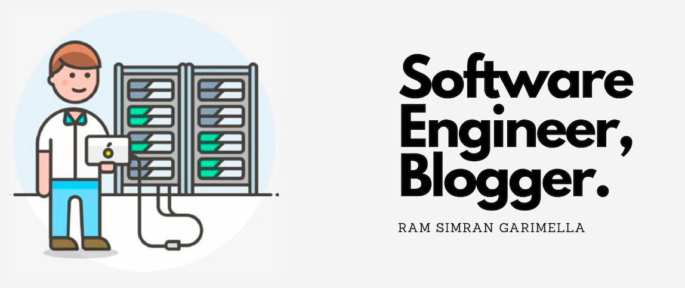

# Hi, I'm Ram 👋 👨‍💻

I'm a software engineer who is passionate about making open-source more accessible, creating technology to elevate people, and building community.
Some technologies I enjoy working with include ReactJS, Mobile Applications with React-Native and For Server Side, Express, GraphQL, and Python.

* 🌱 I’m learning Devops and Building Cost-Effective Systems.
* 📫 Sharing updates and writing stuff on <a href="https://www.quora.com/profile/Ram-Simran-Garimella">Quora</a>.

 

<h2>Tech Stack 💻</h2>

  
  
  
  
  
  
  
  
  
  
  
  
  
  
  
  
  
  
  
  
  

<h2>GitHub Analytics ⚙️</h2>

  
  

## Profile Views

<h2 align="center">  <h2>

## Connect with Me 🤝🏻 &nbsp;

<h3 align="center">

<h3 align="justify">Feel free to send me a connection request</h3>
